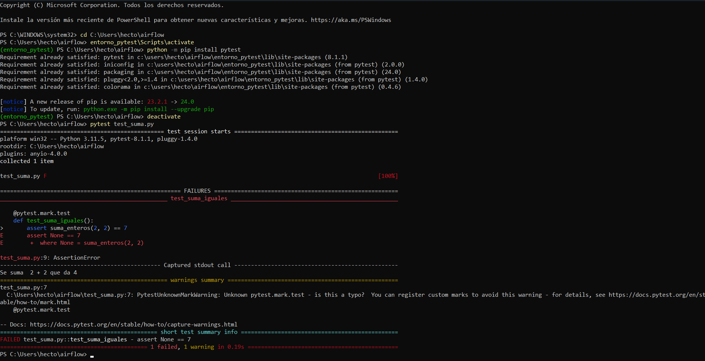

# Tests with Pytest and Airflow

## Prepare the enviroment

1. We need to insatall the virtual enviroment with command **pip install virtualenv**.
2. We create a virtual enviroment on the enviroments folder with the command **python -m venv entorno_pytest**.
3. With the command **entorno_pytest\Scripts\activate** we activate our virtual enviroment where we are going to install all the libraries that we are gonna usae, on this case we are using **pytest** and the command **python -m pip install pytest**.
4. Once it's done with the installation of the library of pytest we turn off the virtial enviroment, because we are not gonna install any more libraries, we use the commmand **deactivate**.

## Error on the terminal
We execute the python code **test_suma** with the command **pytest test_suma.py** that results on the next image of the Windows PowerShell.

This error happens because the addition result of 2 and 2 it's 4, not 7.

##  Owner
Hector de la Cruz Baquero - [Linkdedin](https://www.linkedin.com/in/h%C3%A9ctor-de-la-cruz-baquero-ba193429b/) - [Webpage](https://hectorcrzbq.github.io/)
