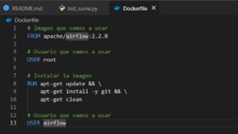

# Código de Airflow y pytest

Descargar la imagen de docker de Apache Airflow:
**docker pull apache/airflow:latest** desde cmd

RECORDATORIO: **Siempre que trabajemos, se debe crear un entorno virtual para instalar todas las librerías y bibliotecas que vamos a utilizar.**

Dentro de la Windows Powershell en modo administrador para que no den errores los scripts
1.	Accedemos a **C:\Users\hecto\airflow**
2.	Se debe instalar el entorno virtual con **pip install virtualenv**
3.	Creamos el entorno virtual en la carpeta correspondiente **python -m venv entorno_pytest**.
4.	Con el comando **entorno_pytest\Scripts\activate** activamos nuestro entorno virtual donde vamos a tener instaladas las librerías que luego usaremos, en este caso se va a usar pytest por lo que ejecutamos el siguiente comando: **python -m pip install pytest** .
5.	Una vez se haya terminado de instalar la librería de pytest se apaga el entorno ya que no vamos a instalar más librerías, con el comando **deactivate**.
Creamos el siguiente código:

 
Ejecutamos el código usando el comando de **pytest test_suma.py**, que nos devuelve el siguiente resultado por PowerShell:

Nos devuelve un error ya que el resultado obtenido de la suma no es el correcto, porque la suma de 2 + 2 nos debería de devolver el valor 4, no el 7.
Debemos crear un **Dockerfile** que nos permita construir la imagen de Airflow

Tenemos que crear **docker-compose.yml** para coordinar:

 
Tenemos que crear dentro de una nueva carpeta **dags** el código de **test_workflow.py**:

 
Se ejecuta el comando **docker-compose up –build** para construir el contenedor de docker

Se accede usando el **http://localhost:8080**

Revisar la version de Airflow:

# Mejoras pendientes
- Subir pytest a github en la rama develop
- Usar Airflow de Docker hacer la prueba
-	Cuando devuelva el test realizado success se debe subir a github en la rama main.
 
